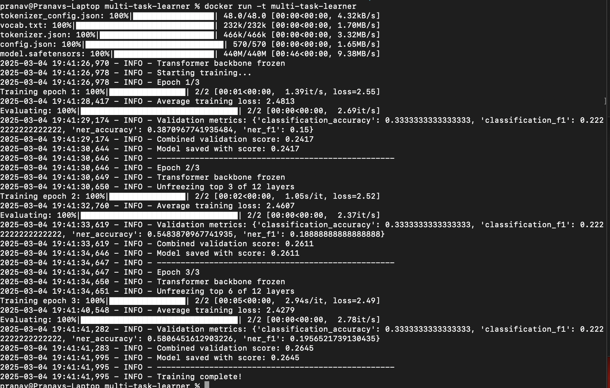

# Multi-task-learner
This repository the implementation of multi-task learning
## Setup

* Clone the repository:
    * `git clone https://github.com/pranav1601/multi-task-learner.git`
    * `cd multi-task-learner`

* Build and run the Docker container:
    * `docker build -t multi-task-learner .`
    * `docker run -it multi-task-learner`

## Architecture Choices Explanation - sentence transformers
* Base Model: I chose BERT (bert-base-uncased) as the transformer backbone because it provides strong performance for general NLP tasks. It has a solid understanding of language semantics, which is essential for generating meaningful sentence embeddings.

* Pooling Strategy: I chose to implement mean pooling and not CLS or max which averages all token embeddings, weighted by the attention mask. I preferred this as it considers all tokens equally.

* Projection Layer: I added an optional projection layer to adjust the embedding dimension if needed. This provides flexibility to match specific downstream task requirements.

* Layer Normalization: Applied to stabilize the embedding distributions, which helps with training stability and downstream task performance.

* L2 Normalization: I normalize the final embeddings to unit length, which is standard in sentence embedding tasks.

## Architecture Choices for Multi-Task Learning
* Shared Backbone: The BERT transformer backbone is shared between all tasks, allowing knowledge transfer across tasks and efficient parameter usage.

* Task-Specific Heads:
    * A (Sentence Classification): Added a classification head with a fully connected network that takes the sentence embedding and outputs class probabilities.
    * B (Named Entity Recognition): Added an NER head that operates at the token level, taking the token representations from the final hidden state and predicting entity tags for each token.

* Flexible Forward Pass: I implemented a task-specific forward pass that allows the model to:
    1. Generate sentence embeddings (useful for retrieval, similarity tasks)
    2. Perform sentence classification (Task A)
    3. Perform named entity recognition (Task B)
    4. Or all of the above simultaneously

* Shared Representation Learning: Both task heads build upon the same transformer representations, but use them differently:
    * Classification uses a mean pooled sentence-level representation
    * NER uses token-level representations

* Separation: Each task has a dedicated head with its own parameters, allowing for task-specific optimization while sharing the majority of parameters in the backbone.

## Training Considerations for Multi-Task Learning
1. Freezing the Entire Network
    Implications:

    * The model becomes a feature extractor with fixed representations and no adaptation to the specific tasks or domain.
    * Very fast training as only forward passes are needed and Minimal memory requirements during training

    Advantages:

    * Extremely computationally efficient
    * Suitable when pre-trained model is already highly aligned with target tasks

    Disadvantages:

    * Limited ability to adapt to domain-specific nuances
    * Lower performance ceiling compared to fine-tuning approaches
    * Cannot correct for biases or errors in the pre-trained model

    Best Used When:

    * very limited computational resources available
    * tasks are very similar to what the pre-trained model was trained on
    * avoid any risk of overfitting on small datasets

2. Freezing Only the Transformer Backbone
    Implications:

    * The shared representations remain fixed and only task-specific heads are trained
    * Moderate training efficiency

    Advantages:

    * Reduces overfitting on small datasets
    * Computationally more efficient than full fine-tuning
    * Allows task-specific adaptation while preserving pre-trained knowledge

    Disadvantages:

    * May not adapt well to domain shifts from pre-training data
    * Fixed backbone may limit performance on specialized tasks

    Best Used When:

    * dataset is small to medium-sized
    * domain is reasonably similar to pre-training data
    * multiple diverse tasks that can benefit from shared representations

3. Freezing Only One Task-Specific Head
    Implications:

    * The shared backbone and one task head continue to learn
    * The frozen task head maintains stable performance on its task
    * The backbone adapts primarily to the unfrozen task
    * Knowledge transfer between tasks becomes asymmetric

    Advantages:

    * Allows adaptation to a new task while preserving performance on an established task
    * Useful for continual learning scenarios
    * Good when one task is well-optimized but the other needs improvement

    Disadvantages:

    * The backbone may drift toward optimizing the unfrozen task at the expense of the frozen one
    * Reduced multi-task benefits since knowledge sharing becomes one-directional

    Best Used When:

    * already well-performing model for one task and want to add another task
    *  preserve performance on a critical task while adapting to a secondary task
    * Resources allow backbone fine-tuning but you want to maintain stability in one task
    * continual learning

#### Transfer Learning Approach
- Pre-trained Model Selection
    * I would choose RoBERTa-base as the pre-trained model for this multi-task setting for several reasons:

    * Improved Training Methodology: RoBERTa improves upon BERT with better training procedures (dynamic masking, larger batches) leading to more robust representations.
    * Representation Quality: It produces higher quality contextual representations than BERT, which benefits both sentence classification and token-level tasks like NER.
    * Stability: RoBERTa tends to be more stable during fine-tuning, which is valuable in a multi-task setting where optimization becomes more complex.

#### Layer Freezing Strategy
- I would implement a progressive unfreezing approach:

    1. Initial Phase:

        * Freeze the entire backbone transformer
        * Train only the task-specific heads for 2-3 epochs
        * This allows the heads to adapt to the task before modifying the shared representations

    2. Intermediate Phase:

        * Keep the bottom N layers of the transformer frozen
        * Unfreeze and train the top layers along with task heads
        * The lower layers capture more general linguistic patterns while upper layers have more task-specific representations

    3. Final Phase:

        * Optionally unfreeze all layers with a very small learning rate (e.g., 1e-5 or lower)
        * Apply layer-wise learning rate decay (lower rates for lower layers)
        * Allow full model adaptation while minimizing catastrophic forgetting

    Rationale:

    * Linguistic Hierarchy in Transformers: Lower layers in transformers tend to learn general linguistic features, while upper layers learn more task-specific representations. By preserving the lower layers, we maintain the fundamental language understanding.
    * Efficiency-Performance Tradeoff: Progressive unfreezing balances computational efficiency with model performance, gradually increasing model capacity as training progresses.
    * Multi-Task Optimization: The approach allows the model to find a good shared representation space for both tasks without one dominating the other.
    * Resource Considerations: This tiered approach also allows for early stopping at any phase based on validation performance, making it adaptable to different computational constraints.

#### Practical Implementation
* Monitor validation performance on both tasks separately and use a combined metric for overall model quality
* Implement task sampling strategies based on dataset sizes and task difficulty
* Use task-specific learning rates if one task is more difficult than the other

# Implementation of Training Loop
### Progressive Unfreezing
- Initial State: Begin with frozen backbone, trainable task heads
- Gradual Adaptation: Unfreeze 3 transformer layers at a time from top down

### Loss Calculation
- Direct Weighting: Simple weighted sum of task losses

### Optimization
- Standard AdamW: recommended defaults for NLP fine-tuning
- Learning Rate Schedule: Linear schedule with warmup
- Gradient Clipping: Prevent gradient explosion in multi-task setting

### Evaluation
- Task-Specific Metrics: Track accuracy and F1 for each task
- Simple Aggregation: Average metrics for model selection
- Checkpoint Saving: Save best model based on combined score

